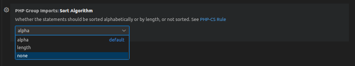

# Change Log

## 1.1.3

### Added
  - Setting to sort grouped imports by alpha | length | none. default: alpha
    - 

## 1.1.2

### Added
  - Setting to enable/disable notification on group import operation complete.
    - 
    - 

## 1.1.1

### Fixes
  - having first import statement commented with `#` or `/*` will be duplicated in output. [#4](https://github.com/mrazinshaikh/php-group-imports-extension/issues/4)

### Added
  - MIT license in [package.json](package.json#L7,15)

## 1.0.0

### Changed
- Handle commented imports (single line comment with `#` or `//` and block comment with `/* */`)

## 0.1.0

### Added
  - Initial project structure
  - Initial php import grouping logic implementation

**Enjoy!**