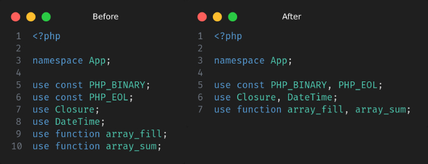

# Change Log

## 1.1.9

### Added
  - Added "PHP Group Imports action in explorer context menu."
    - 

## 1.1.8

### Fixes
  - Blank line between import statement type (class, const, function) lost (on [v1.1.7](https://github.com/mrazinshaikh/php-group-imports-extension/releases/tag/v1.1.7)) issue fixed.
  - PHP internal imports group issue fixed.
    - 

## 1.1.7

### Fixes
  - Fix extra new line at the end of import statements.

## 1.1.6

### Added
  - Sample input and output screenshot added.

## 1.1.5

### Added
  - Order (sort) imports statements in ascending or descending order.
    - 
  - Trigger Save window on operation complete.

### Fixes
  - Extension title in settings fixed.
    - 

## 1.1.4

### Added
  - Order imports by type. php-cs imports-order rule configurable from settings. default `null`
    - 

## 1.1.3

### Added
  - Setting to sort grouped imports by alpha | length | none. default: alpha
    - 

## 1.1.2

### Added
  - Setting to enable/disable notification on group import operation complete.
    - 
    - 

## 1.1.1

### Fixes
  - having first import statement commented with `#` or `/*` will be duplicated in output. [#4](https://github.com/mrazinshaikh/php-group-imports-extension/issues/4)

### Added
  - MIT license in [package.json](package.json#L7,15)

## 1.0.0

### Changed
- Handle commented imports (single line comment with `#` or `//` and block comment with `/* */`)

## 0.1.0

### Added
  - Initial project structure
  - Initial php import grouping logic implementation

**Enjoy!**